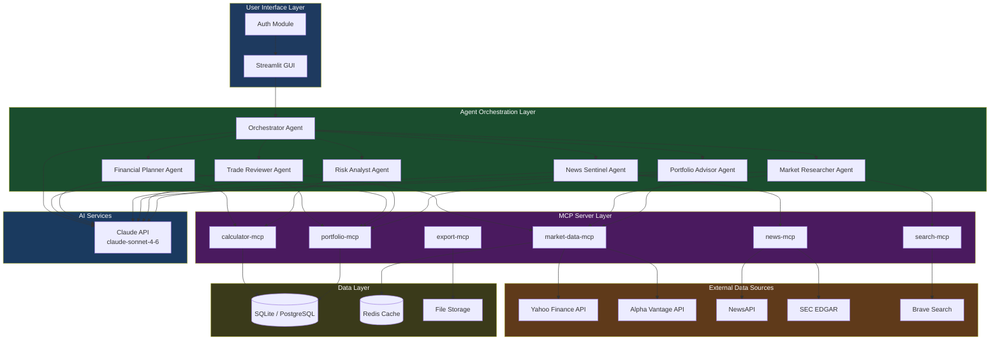
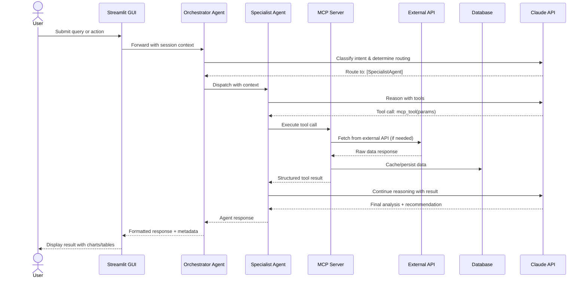
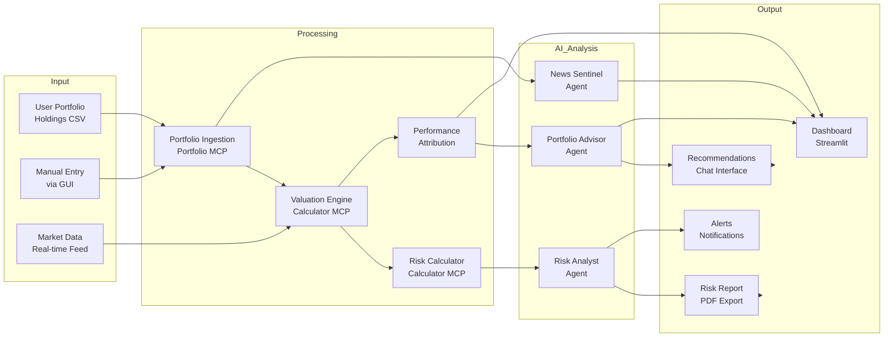
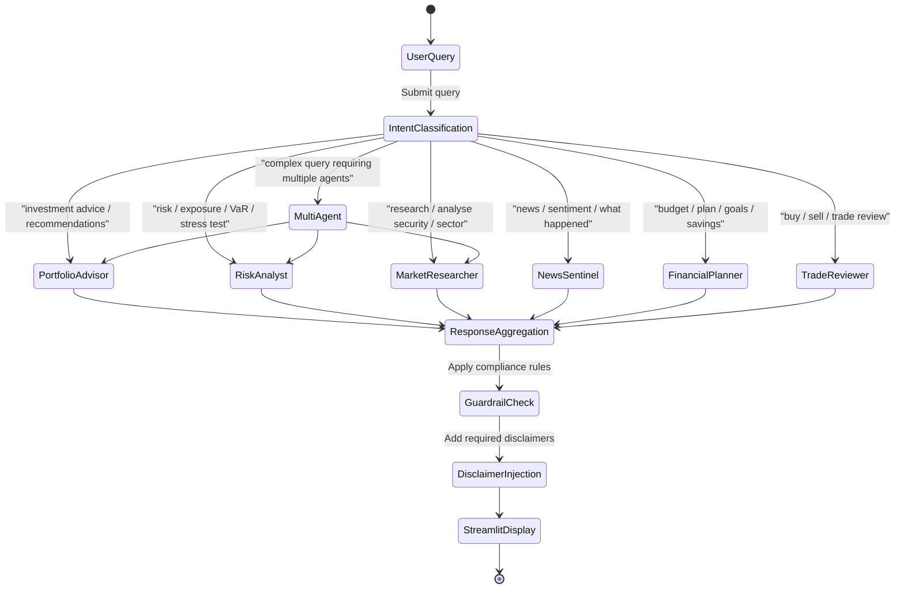
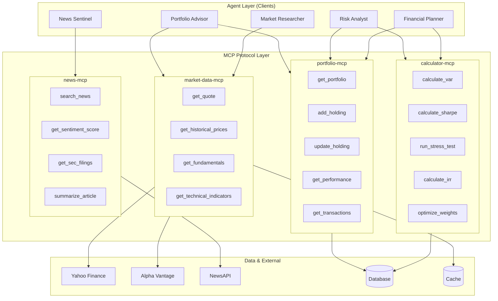
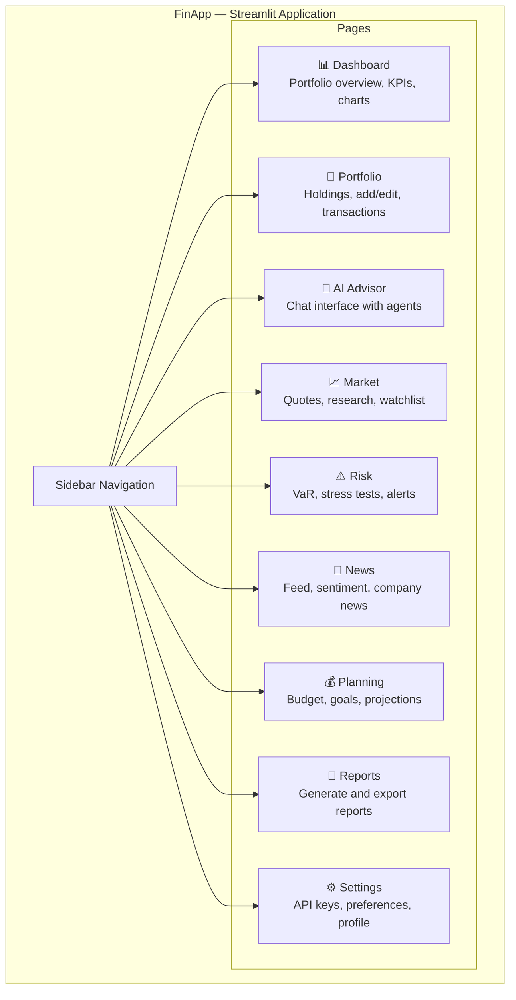

# FinApp — Architecture & High-Level Design Diagrams

---

## 1. System Architecture Diagram

---

## 2. High-Level Design Diagram — Component Interactions

---

## 3. Data Flow Diagram — Portfolio Analysis

---

## 4. Agent Orchestration Flow

---

## 5. MCP Server Architecture

---

## 6. Streamlit GUI Layout

